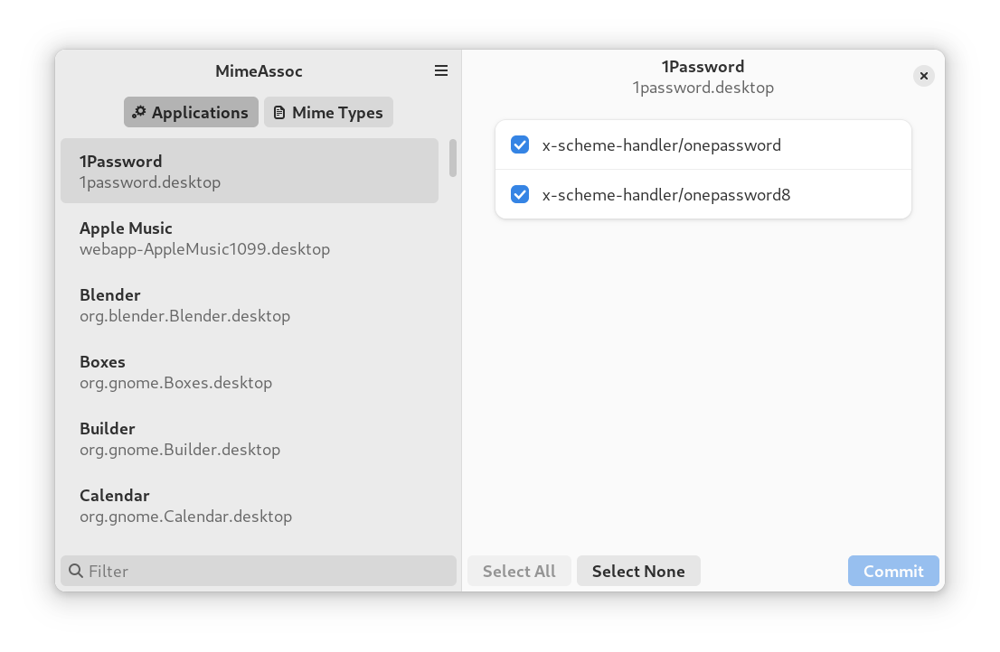
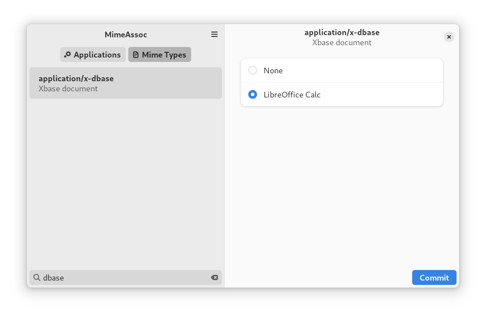

# mimeassoc
Utility for setting default applications in Gnome

### Screenshots

MimeAssoc GUI can help give ownership of supported mime types to apps:


It can also, in reverse, associate apps to specific mimetypes:


### CLI

MimeAssoc also has a CLI, with a fairly simple interface. It also supports JSON output if that's your thing.
```
Usage: mimeassoc_cli [OPTIONS] [COMMAND]

Commands:
  mime-types     Display all registered mime types
  mime-type      Display all applications which support the specified mime type, and which is currently assigned as default handler Passing a wildcard mimetype such as "image/*", is equivalent to passing "image/bmp image/png image/tiff ... image/N"
  applications   Display all applications and their supported mime types, with an asterisk indicating which are registered to that application
  application    Display a specific application and the mimetypes it supports, with an asterisk indicating which are registered to that application
  set            Assign an application as default handler for one or more mime types. If no mime types are specified, makes the specified application default handler for ALL it's supported mime types
  reset          Reset assignments for specified mime types to system default
  configuration  Display the configuration state of `mimeassoc`. Shows the mime association sources, and where desktop entry files were loaded from, in chain order
  help           Print this message or the help of the given subcommand(s)

Options:
  -j, --json     If set, produce all output in JSON
  -h, --help     Print help
  -V, --version  Print version
```